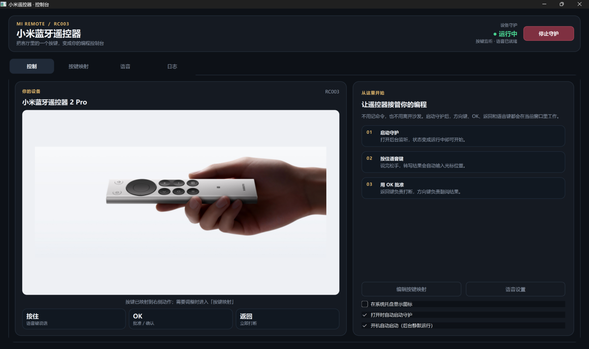
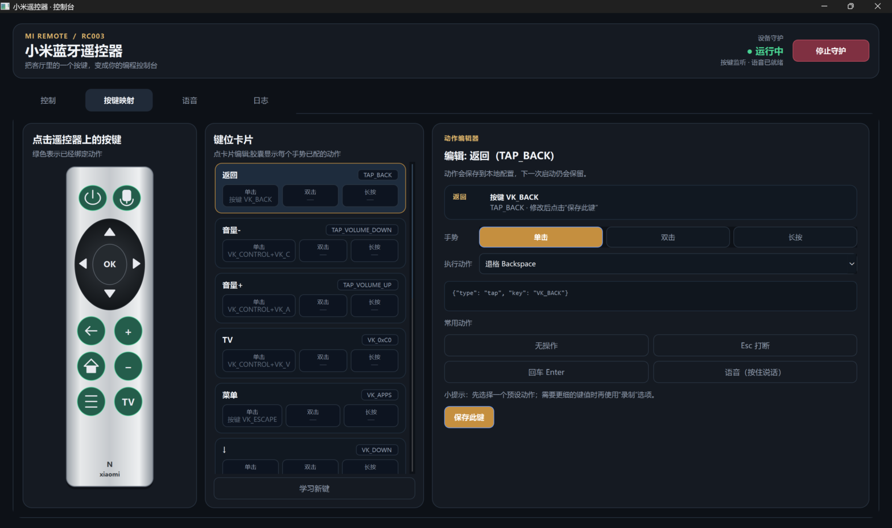

# miremote-vibe

**把 65 块的小米蓝牙遥控器 2 Pro，变成 Windows 上的 vibe coding 遥控器。**

躺在沙发上，按住遥控器语音键对 AI 编程助手说话，松手后文字自动打进终端；
方向键翻阅 AI 的输出、OK 批准、返回键打断、音量键调音量。

**Turn a $10 Xiaomi Bluetooth Remote 2 Pro into a vibe coding controller for Windows.**

Lean back on your couch, hold the remote's voice button to talk to your AI
coding assistant, release, and the transcribed text lands in your terminal.
Arrow keys scroll the AI's output, OK approves, Back interrupts, volume keys
adjust volume.

**软件界面**（控制台 / 按键映射可视化编辑 / 语音模式切换）：

| 控制台 / Console | 按键映射 / Key Mapping |
|---|---|
|  |  |

> [!IMPORTANT]
> **项目现状**：这是一个 vibe Coding 项目——在一天之内由 AI agent 与作者
> 协作完成，代码比较粗糙，不是一个完善的产品。它在我的机器上完整跑通，
> 但没有经过多设备、多环境的测试。
>
> **发布目的**：发布出来只是希望给大家一个参考，尤其是给 Windows 系统下
> 想要使用小米蓝牙遥控器硬件做类似事情的人提供参考——这里的设备协议逆向、
> 蓝牙语音解码、被系统丢弃按键的救回方案，全网目前没有现成的 Windows 实现。
>
> **交流意愿**：欢迎友好交流。提 Issue、发 PR、讨论改进方向都很欢迎，
> 但请保持善意，不承诺及时回复，也不保证在任何环境都能工作。
>
> **Project status**: This is a vibe-coding project — built in a single day by
> an AI agent working with its author. The code is rough; it is **not** a
> polished product. It works end-to-end on my machine but has not been tested
> across different hardware or environments.
>
> **Why published**: Shared purely as a reference, especially for people on
> Windows who want to hack on this Xiaomi remote hardware — the protocol
> reverse engineering, Bluetooth voice decoding, and recovery of keys silently
> dropped by the Windows driver have no existing open-source Windows
> implementation that we know of.
>
> **Community**: Friendly technical discussion is welcome — issues, PRs and
> improvement ideas appreciated. Please be kind; no guarantee of timely
> responses or that it works everywhere.

---

## 中文目录

- [功能一览](#功能一览全部真机验证)
- [它是怎么工作的](#它是怎么工作的)
- [快速开始](#快速开始)
- [踩坑记录](#踩坑记录本文档最有价值的部分)
- [已知限制](#已知限制)
- [Roadmap](#roadmap欢迎-pr)
- [致谢与许可](#致谢与许可)

## English Contents

- [Features](#features-verified-on-real-hardware)
- [How It Works](#how-it-works)
- [Quick Start](#quick-start)
- [Pitfalls Log](#pitfalls-log-the-most-valuable-part-of-this-doc)
- [Known Limitations](#known-limitations)
- [Roadmap](#roadmap-prs-welcome)
- [Credits & License](#credits--license)

---

# 中文

## 功能一览（全部真机验证）

| 功能 | 说明 |
|---|---|
| 按键捕获 | 方向/OK/主页/菜单/TV/电源/语音键，Raw Input 按设备过滤（不影响物理键盘） |
| **哑键救回** | **返回/音量±/静音的报文被 Windows 驱动丢弃**，本项目用 Frida Gadget 注入 WUDFHost 取回（macOS 项目也没有的能力） |
| 本地语音 | 按住说话→松手→ATVV 蓝牙协议解码→faster-whisper 本地转写→文字粘贴（全离线） |
| 微信语音模式 | 声音桥接给微信输入法识别（自动去语气词、整理语句） |
| Qt GUI | 按键映射可视化编辑（点遥控器图绑键）+ 语音模式切换 + 日志 + 系统托盘 |
| 开机自启 | 静默后台启动 + 自动启动守护 |

## 它是怎么工作的

```
① 按键：遥控器 HID → Raw Input（VID/PID 过滤）→ 动作系统（SendInput/剪贴板/…）
② 语音：遥控器 ATVV(GATT) → ADPCM 解码 → whisper 转写（本地）或 CABLE 桥接（微信）
③ 哑键：WUDFHost 内 Gadget 钩子 → localhost:30685 → 解码成按键边沿
```

三条链路的关键技术细节：

- **ATVV 协议**：遥控器麦克风走 Google ATVV 私有 GATT 服务（`AB5E0001-...`），
  Windows 不认它为麦克风，本项目从握手（`GET_CAPS`）到 IMA ADPCM 解码全链路实现
- **哑键机制**：返回键 usage=0xF1、音量=0x80/0x81，HidOverGatt 驱动收到报文但
  翻译不成键盘事件直接丢弃；frida-gadget DLL（官方发布物，双 SHA-256 锁定）
  注入 WUDFHost 钩 `NtDeviceIoControlFile` 取回报文
- **微信桥接的架构教训**：遥控器语音键=F5 透传，按住期间注入热键会被微信的
  组合键检测干扰——最终采用"录音期间零注入缓冲 + 松手后短击切换式热键 +
  播放到 VB-CABLE"的架构

## 快速开始

### 从源码运行

```bat
:: 依赖：Python 3.10+（在 3.14 上开发测试）
pip install PySide6-Essentials faster-whisper nvidia-cublas-cu12 nvidia-cudnn-cu12 ^
            winrt-windows-devices-bluetooth winrt-windows-storage-streams sounddevice pyinstaller

python -m miremote app
```

蓝牙配对遥控器（长按主页+菜单键进入配对模式），启动守护即可。
详细步骤见 [docs/使用说明.md](docs/使用说明.md)。

### 打包 exe

```bat
:: 可选：哑键拦截需要 Frida Gadget（约 7MB，仓库不含二进制）
curl -L -o assets\frida-gadget-17.15.3-windows-x86_64.dll.xz ^
  https://github.com/frida/frida/releases/download/17.15.3/frida-gadget-17.15.3-windows-x86_64.dll.xz

pyinstaller miremote.spec --noconfirm
```

## 踩坑记录（本文档最有价值的部分）

一天开发里实测踩过的坑，每一条都是真实翻车后修的：

### ctypes 四连坑（同一类问题踩了四次）

**所有返回 HANDLE/指针的 Win32 API 必须显式声明 `restype=ctypes.c_void_p`**，
否则 64 位句柄被截断成 32 位，症状五花八门：

| API | 截断后的症状 |
|---|---|
| `HWND` | WinError 1400 无效窗口句柄 |
| `GetCurrentProcess` | WinError 6 句柄无效 |
| `GlobalLock` | memmove 写 NULL → access violation |
| `GetClipboardData` | 同上 |

### SendInput 静默失效（潜伏一个月的 bug）

`INPUT` 结构体的 union 必须包含 **MOUSEINPUT + KEYBDINPUT + HARDWAREINPUT 全部三种**。
只写 KEYBDINPUT 时 `sizeof(INPUT)=32`（x64 应为 40），`SendInput` 因 cbSize
不匹配**静默返回 0**——所有按键动作全部失效但不报任何错。方向键走透传所以
一直没暴露。

### 遥控器语音键 = F5 透传会干扰微信热键

按住遥控器语音键期间，F5 持续透传到焦点窗口，微信的组合键检测（应该是低级
钩子自绘状态机）被额外按键干扰，浮窗不出现。实测复现后改为切换式架构。

### Qt 窗口不能被外部 ShowWindow 显示

从另一个进程 `ShowWindow` 硬显示 Qt 窗口 → Qt 不知道 → 不重绘 → **窗口空白**。
跨进程唤回必须让 Qt 亲自 `show()`（本项目用 TEMP 目录信号文件 + 500ms 轮询）。

### whisper 子进程必须干净环境

宿主 shell 的配置文件（starship/nvm 等）会污染环境变量，导致 ctranslate2 在
CUDA 模型加载时原生崩溃（access violation）。解法：转写放干净环境子进程
（只传必要变量 + `HF_HUB_OFFLINE=1` + 显式 UTF-8 解码）。
另一个坑：空字符串环境变量不能传（`HF_HOME=""` 会让缓存定位失败）。

### 打包（PyInstaller）相关

- 直接打包包内 `__main__.py` 会相对导入失败——用顶层 `launcher.py` 入口
- `faulthandler.enable()` 在 frozen 下 `sys.stderr is None` 直接崩——加 frozen 判断
- faster-whisper 的 `silero_vad_v6.onnx` 不会自动打包——spec 显式 collect
- frozen 子进程要用 `[sys.executable, "子命令", ...]` 而不是脚本路径
- **exe 的自定义参数必须在 `__main__.main()` 登记**（`--silent` 被当未知命令
  打印帮助后秒退，造成开机自启"没反应"的假象）

### 更多

完整坑清单和调试方法论见 [docs/AGENT_GUIDE.md](docs/AGENT_GUIDE.md) §5-§7，
开发全过程记录见 [docs/开发说明.md](docs/开发说明.md)（中文）。

## 已知限制

- 返回键拦截需要 UAC 提权（开机自启场景会弹窗，计划任务方案可规避，见 roadmap）
- 语音键/方向键透传有副作用（焦点在浏览器时 F5=刷新）
- 只在 RC003（固件 2671）+ 一台 RTX 4060 机器上验证过
- 转写准确率：whisper medium 约 90%+，说"登录"偶尔变"灯露"

## Roadmap（欢迎 PR）

- [ ] 开机自启 UAC 优化（计划任务以最高权限运行）
- [ ] FunASR/SenseVoice 替换 whisper（中文 CER 约一半、快 12 倍）
- [ ] 语音子进程常驻池（降低松手→出字延迟）
- [ ] 低级键盘钩子按设备拦截透传键
- [ ] 多遥控器/其他型号支持（需 learn 模式采集 usage 表）

## 致谢与许可

- 哑键拦截方案移植自 GPL-3.0 项目 [xxb26553663-star/remote-bridge-hub](https://github.com/xxb26553663-star/remote-bridge-hub)
- ATVV 协议参考 [fanxeon/mi-ao](https://github.com/fanxeon/mi-ao) 的真机协议文档
- UI 参考 [nijez/open-voice-bridge](https://github.com/nijez/open-voice-bridge)
- macOS 同类项目：[godarrenw/mi_remote_control](https://github.com/godarrenw/mi_remote_control)

本项目代码采用 **MIT** 许可（见 [LICENSE](LICENSE)）。
"Frida"、"VB-CABLE"、"微信输入法"、"小米"为各自所有者的商标/产品，
本项目与它们无隶属关系。

---

# English

## Features (verified on real hardware)

| Feature | Notes |
|---|---|
| Button capture | D-pad / OK / Home / Menu / TV / Power / Voice via Raw Input, filtered by device (physical keyboard untouched) |
| **Dead-key recovery** | **Back / Volume± / Mute HID reports are silently dropped by the Windows driver** — this project recovers them by injecting a Frida Gadget into WUDFHost (not even the macOS projects do this) |
| Local voice | Hold-to-talk → release → ATVV Bluetooth decode → faster-whisper local transcription → paste (fully offline) |
| WeChat voice mode | Audio bridged to WeType IME recognition (auto-removes filler words, polishes sentences) |
| Qt GUI | Visual key remapping (click the remote picture) + voice mode switch + log + system tray |
| Boot autostart | Silent background start + service auto-launch |

## How It Works

```
① Buttons: remote HID → Raw Input (VID/PID filter) → action system (SendInput/clipboard/…)
② Voice:   remote ATVV (GATT) → ADPCM decode → whisper (local) or CABLE bridge (WeChat)
③ Dead keys: Gadget hook inside WUDFHost → localhost:30685 → decoded key edges
```

Key technical details:

- **ATVV protocol**: the remote's microphone streams over Google's ATVV private
  GATT service (`AB5E0001-...`). Windows does not expose it as a microphone, so
  this project implements the full chain — from the `GET_CAPS` handshake to
  IMA ADPCM decoding.
- **Dead keys**: the Back key usage (0xF1) and volume usages (0x80/0x81) arrive
  at the HidOverGatt driver but cannot be translated into keyboard events, so
  Windows drops them. A frida-gadget DLL (official release, dual SHA-256
  pinned) is injected into WUDFHost to hook `NtDeviceIoControlFile` and
  recover the reports.
- **Architecture lesson from the WeChat bridge**: the remote's voice key
  passes through as F5, and holding it interferes with WeChat's hotkey
  detection. The final design buffers audio with zero injection while
  recording, then uses a toggle-style hotkey tap after release, followed by
  playback into VB-CABLE.

## Quick Start

### Run from source

```bat
:: Requires Python 3.10+ (developed and tested on 3.14)
pip install PySide6-Essentials faster-whisper nvidia-cublas-cu12 nvidia-cudnn-cu12 ^
            winrt-windows-devices-bluetooth winrt-windows-storage-streams sounddevice pyinstaller

python -m miremote app
```

Pair the remote via Bluetooth (hold **Home + Menu** to enter pairing mode),
then start the service. Full walkthrough in [docs/使用说明.md](docs/使用说明.md) (Chinese).

### Build the exe

```bat
:: Optional: dead-key recovery needs the Frida Gadget (~7MB, not committed)
curl -L -o assets\frida-gadget-17.15.3-windows-x86_64.dll.xz ^
  https://github.com/frida/frida/releases/download/17.15.3/frida-gadget-17.15.3-windows-x86_64.dll.xz

pyinstaller miremote.spec --noconfirm
```

## Pitfalls Log (the most valuable part of this doc)

Every pitfall below was hit for real during a single day of development:

### The ctypes quadruple trap (same class of bug, four times)

**Every Win32 API that returns a HANDLE/pointer must declare
`restype=ctypes.c_void_p` explicitly** — otherwise the 64-bit handle is
truncated to 32 bits with wildly varying symptoms:

| API | Symptom after truncation |
|---|---|
| `HWND` | WinError 1400 invalid window handle |
| `GetCurrentProcess` | WinError 6 invalid handle |
| `GlobalLock` | memmove writes to NULL → access violation |
| `GetClipboardData` | same |

### SendInput failing silently (a month-long latent bug)

The `INPUT` struct's union must contain **all three of MOUSEINPUT +
KEYBDINPUT + HARDWAREINPUT**. With only KEYBDINPUT, `sizeof(INPUT)` is 32
(x64 expects 40) and `SendInput` **silently returns 0** — every key action
dead with zero errors. Arrow keys pass through natively, which is why it
went unnoticed.

### The voice key passes through as F5 and breaks WeChat hotkeys

While the remote's voice button is held, F5 keeps passing through to the
focused window, and WeChat's hotkey detection (a hand-rolled state machine,
likely on a low-level hook) refuses to trigger with extra keys held. Confirmed
by experiment; fixed with the toggle-style architecture.

### Never ShowWindow a Qt window from outside its process

Calling `ShowWindow` on a Qt window from another process → Qt never learns
about it → no repaint → **blank window**. Cross-process revival must let Qt
call `show()` itself (this project uses a TEMP-dir flag file + 500ms polling).

### whisper subprocesses need a clean environment

The host shell's profile (starship/nvm …) pollutes env vars and crashes
ctranslate2 during CUDA model load (access violation). Fix: run transcription
in a clean-env subprocess (minimal vars + `HF_HUB_OFFLINE=1` + explicit UTF-8
decoding). Related trap: never pass empty-string env vars
(`HF_HOME=""` breaks cache resolution).

### PyInstaller notes

- Packaging a package's `__main__.py` directly breaks relative imports —
  use a top-level `launcher.py` entry
- `faulthandler.enable()` crashes under frozen (`sys.stderr is None`) —
  guard with a frozen check
- faster-whisper's `silero_vad_v6.onnx` is not collected automatically —
  collect it explicitly in the spec
- frozen subprocesses must use `[sys.executable, "subcommand", ...]`,
  not script paths
- **Custom exe arguments must be registered in `__main__.main()`** — an
  unregistered `--silent` printed help and exited instantly, faking a broken
  boot autostart

### More

Full pitfall list and debugging methodology in
[docs/AGENT_GUIDE.md](docs/AGENT_GUIDE.md) §5–§7 (Chinese);
the complete development story in [docs/开发说明.md](docs/开发说明.md) (Chinese).

## Known Limitations

- Dead-key recovery requires UAC elevation (a dialog appears on boot;
  a scheduled-task approach can avoid it — see roadmap)
- Voice/d-pad keys pass through with side effects (F5 refreshes a focused browser)
- Only verified on RC003 (firmware 2671) + one RTX 4060 laptop
- Transcription accuracy: whisper medium ≈ 90%+; "登录" (login) occasionally
  becomes "灯露"

## Roadmap (PRs welcome)

- [ ] Boot autostart without UAC prompt (scheduled task with highest privileges)
- [ ] Replace whisper with FunASR/SenseVoice (half the CER, 12× faster for Chinese)
- [ ] Persistent transcription worker pool (lower release-to-text latency)
- [ ] Per-device passthrough blocking via low-level keyboard hook
- [ ] Support more remotes (requires usage-table collection via learn mode)

## Credits & License

- Dead-key recovery ported from the GPL-3.0 project [xxb26553663-star/remote-bridge-hub](https://github.com/xxb26553663-star/remote-bridge-hub)
- ATVV protocol references from [fanxeon/mi-ao](https://github.com/fanxeon/mi-ao)'s real-device protocol docs
- UI inspired by [nijez/open-voice-bridge](https://github.com/nijez/open-voice-bridge)
- macOS siblings: [godarrenw/mi_remote_control](https://github.com/godarrenw/mi_remote_control)

This project's code is released under the **MIT** license (see [LICENSE](LICENSE)).
"Frida", "VB-CABLE", "WeType/微信输入法" and "Xiaomi/小米" are trademarks or
products of their respective owners; this project is not affiliated with them.
